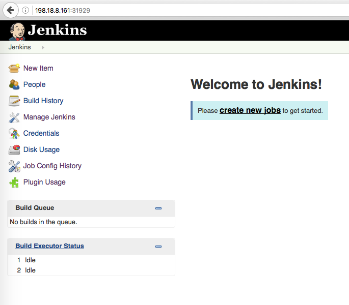
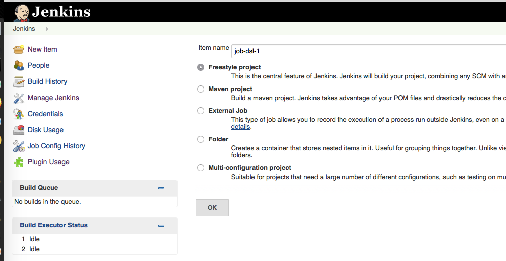
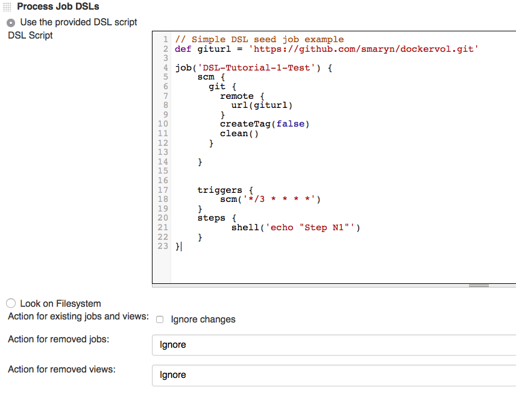
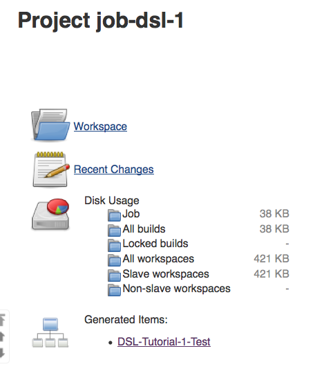
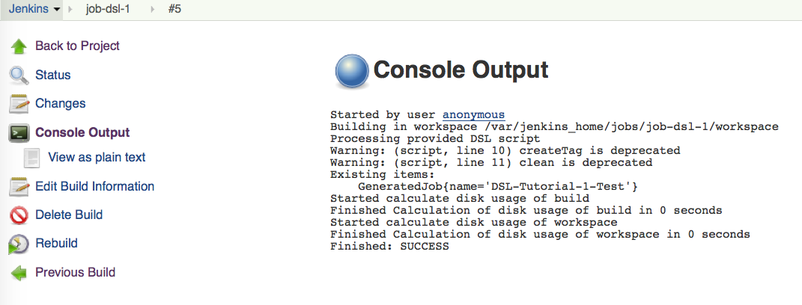
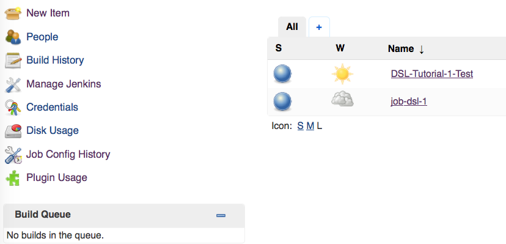

# DSL Jobs for Jenkins in Kubernetes


## 1. Kubernetes pod and service for Jenkins

#### 1.1 Create Kubernetes pod for Jenkins (master) container using [jenkins-pod.yaml](/kube/jenkins-pod.yaml):
```bash
kubectl create -f kube/jenkins-pod.yaml
```
#### 1.2 Create Kubernetes service for Jenkins using [jenkins-service.yaml](/kube/jenkins-service.yaml)
NOTE: At this stage in the command output you should notice the TCP ports which are assigned for Jenkins UI and discovery services:
```bash
kubectl create -f kube/jenkins-service.yaml
```
NOTE: if you want to attach build slave servers **through JNLP (Java Web Start)**: make sure you map the port: ``` 50000 ``` - which will be used when you connect a slave agent. If you are only using [ssh-slaves](https://wiki.jenkins-ci.org/display/JENKINS/SSH+Slaves+plugin), then you do **NOT** need to put port 50000 mapping.

##### 1.3 Check created service status:
```bash
kubectl logs jenkins
```

## 2. Jenkins usage
#### 2.1 Connect to Jenkins UI
Open web browser and type Kubernetes node IP address and TCP port noticed at 1.2 stage. You might see Jenkinse welcome page as below:


#### 2.2 Upgrade Jenkins Plugins (optional)

Go to "Manage Jenkins" - "Plugin Manager".
Select plugins you want to update and complete updating with Jenkins restart.

#### 2.3 Create simple Jenkins DSL seed job

Click "create new jobs" link in welcome screen, choose "Freestyle project" and name it somehow


Choose "Use the provided DSL script" and paste file [dsl-seed-job-simple.goovy](jobs/dsl-seed-job-simple.groovy)
content to the form:


NOTE: In the seed job we creating regular job "DSL-Tutorial-1" which clones git repository from `giturl ` on the described in `triggers` section schedule and accomplish task described in `steps` (just printing "Step N1", but you may define any command or script).
Possible options are documented at
[Jenkins Job DSL API](https://jenkinsci.github.io/job-dsl-plugin/) resource and this manual is quite comprehensive.

You'll get job creation result page with the generated job name in the "Generated item" section%


Click "Build Now" and check console output - it should look like this:


Go "Back to Project" then "Back to Dashboard" and checkout generated job "DSL-Tutorial-1-Test"

The "DSL-Tutorial-1" job has been generated from our DSL seed job "job-dsl-1" and should run as scheduled in `triggers` section of seed job or you may start it manually by pressing on "Build Now" option.
